# EduQuiz_Question_Answering_System

#### FYI:


------


### Questions:

1. Document(2 fields)? 1st field-text , 2nd filed-url? // **one field, url+text!**
2. Is it user allowed to choose any indexing strategy?
3. Where should we use the 'query', 'answer'?
4. **Does the baseline system need to "pre-process" the query?** // not for baseline system, baseline system only needs the default query 
5. **How to implement the feature of "highlighting set of matching passage text for the query"?**
6. **For Baseline System, simply get final query from the 'Lecene.search.Query'?** //yes

------

#### Step1: Create baseline system

- For each passage in the collection, all of the text and url is indexed as a single field. 
- The Analyzer used during index and search is the **Lucene.Net.Analysis.Simple analyzer**. 
- The index does not save information related to field normalisation. 
- The index does not save information related to term vectors. 


#### 1. Task 1 — **Index**:

**mockup: Indexing Strategy** is not settled down, just put it there for now

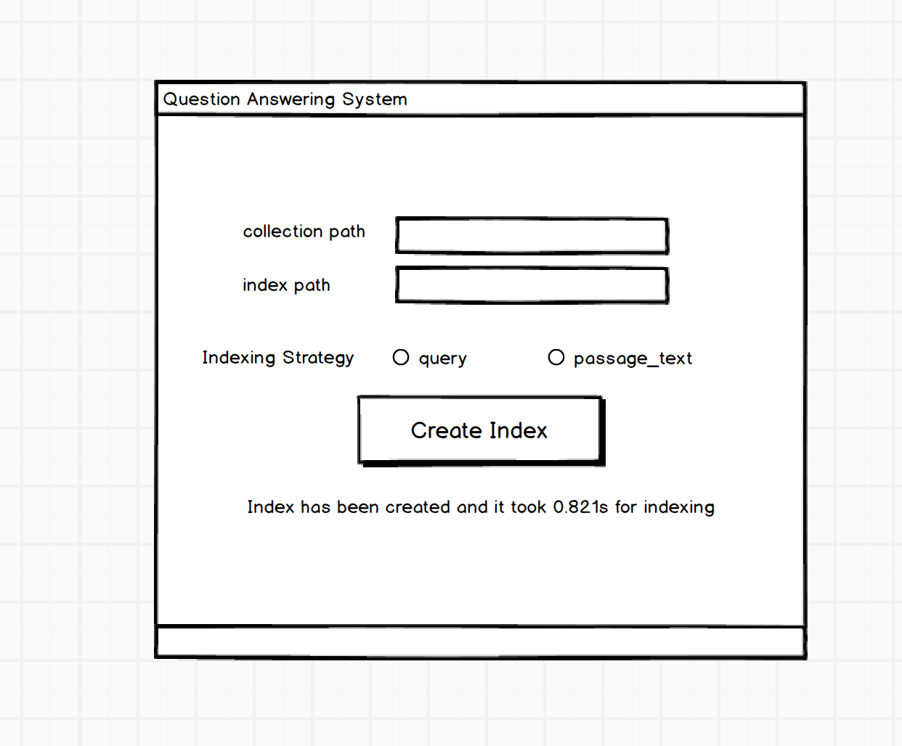


**implemention: Indexing Strategy**

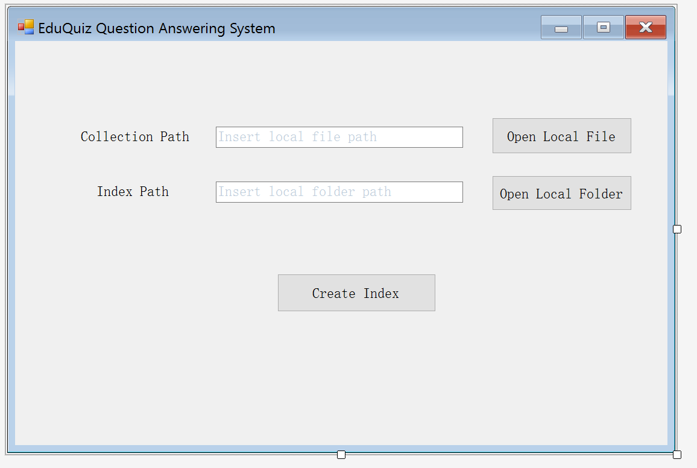


------

#### Progress1: Successfully indexed, and show result of searching 'RBA'—which is a query test;

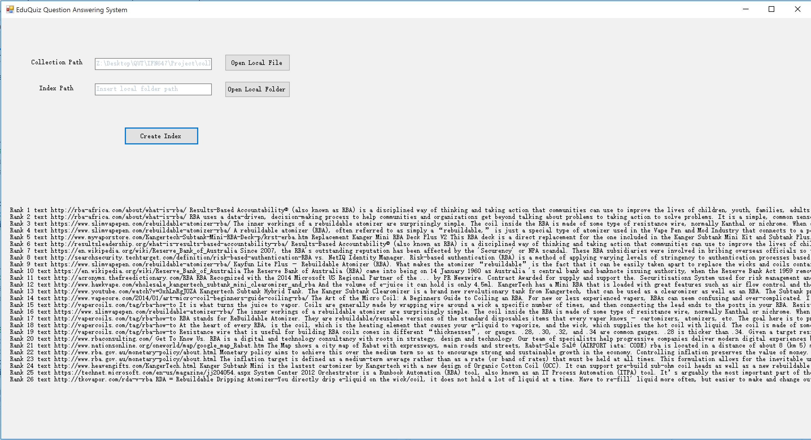

It is able to open the JSON file based on user browsing, and specify a indexing folder based on user browsing. Put a hard coded query of 'RBA' to search for the results, the results are just simply displayed at the bottom of the Indexing Page.

------


#### 2. Task2 — Search:

**mockup:**

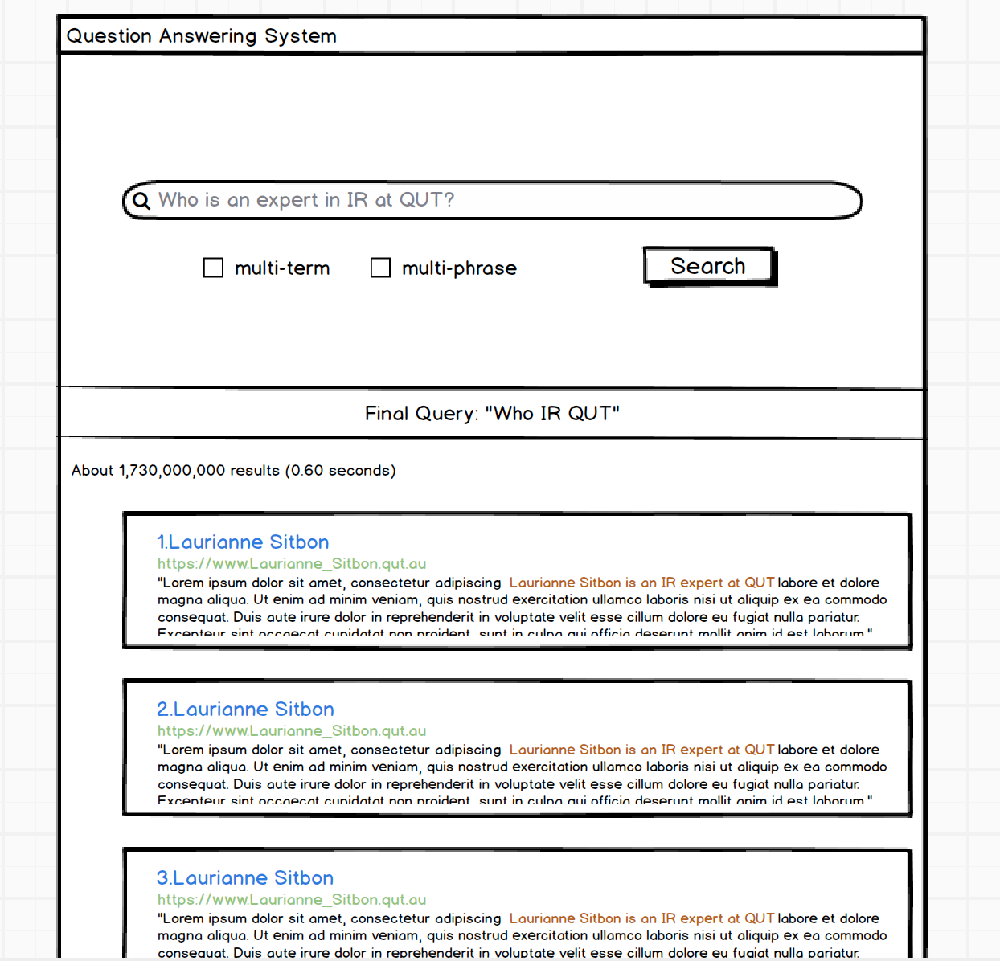

------

#### Progress 2: 

###### 1)display index time  

###### 2) add button to redirect to searching page  

###### 3) simple searching page implementation


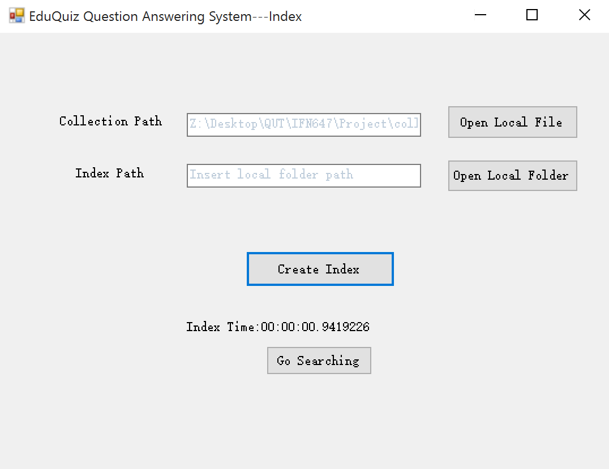


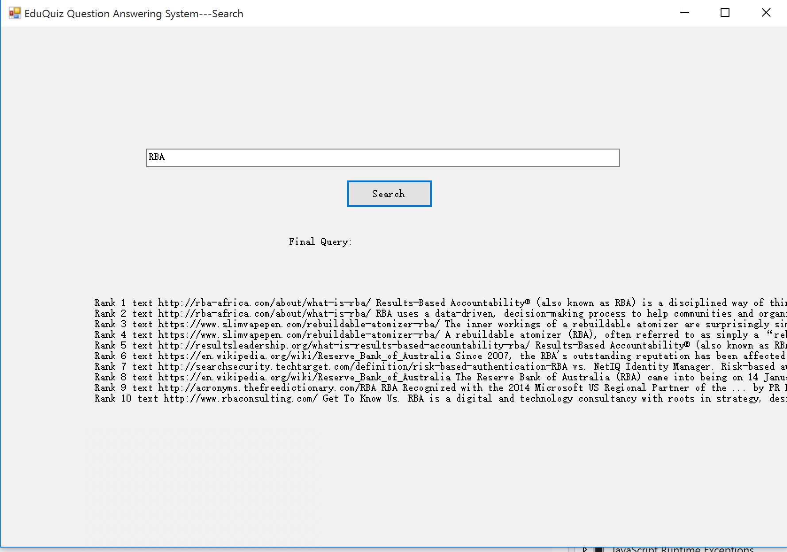

------


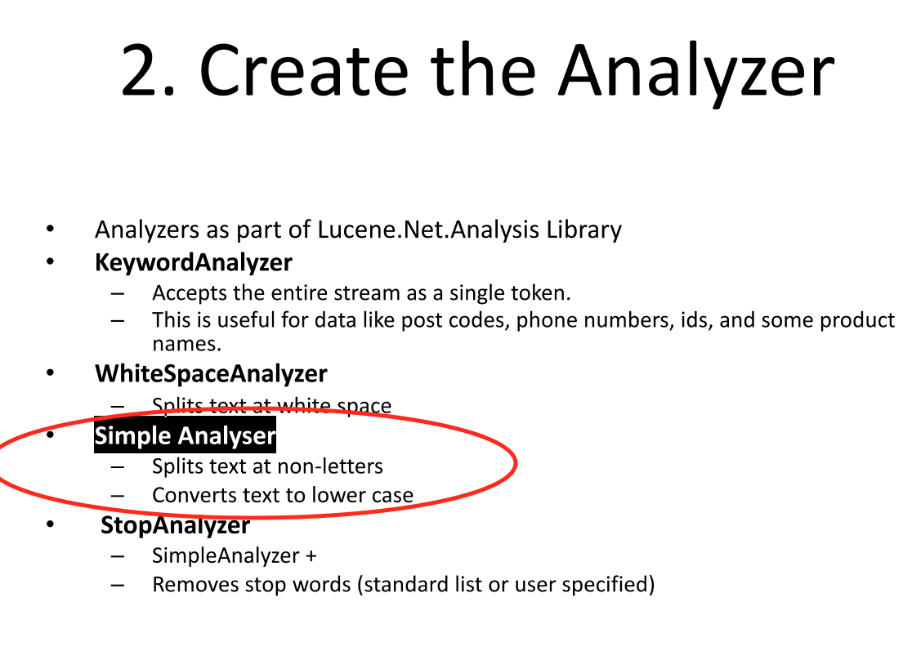tr

------

#### Progress 3:

1) display results in formatted detail

2) view the entire passage in another form

3) add Back button for better user experience


------


### Section 6 : System Evaluation

What have been done:

1. simulation of creating baseline system results
2. simulation of creating qrels file of retrieving the list of passages linked to the query
3. simulation of creating qrels file of retrieving the selected passage(s)


<u>in "Simulation.cs"</u>

```c#
 //important! modify the following paths to your local path
        const string jsonFilePath = @"Z:\Desktop\QUT\IFN647\Project\collection_sample.json";
        const string indexPath = @"C:\Users\CaptainXun\Desktop\QUT\647IndexFolder";
        const string resultPath = @"C:\Users\CaptainXun\Desktop\QUT\647Evaluation\Baseline_Results.txt";
        const string qrels_RetrieveListOfPassages_path = @"C:\Users\CaptainXun\Desktop\QUT\647Evaluation\qrels_RetrieveListOfPassages.txt";
        const string qrels_RetrieveSelectedPassages_path = @"C:\Users\CaptainXun\Desktop\QUT\647Evaluation\qrels_RetrieveSelectedPassages.txt";
        public LuceneInteractive myLuceneApp;

        List<Item> collection;

        public Simulation()
        {
            GetBaselineResults(); //get baseline results, iterate every query in the collection

            CreateQrels_RetrieveListOfPassages(); //create qrels files for the metrics of retrieving the list of passages linked to the query

            CreateQrels_RetrieveSelectedPassage(); //create qrels files for the metrics of retrieving the selected passage(s)
        }


        //get baseline results, iterate every query in the collection
        public void GetBaselineResults()
        {
            myLuceneApp = new LuceneInteractive(jsonFilePath, indexPath);

            collection = Utils.getCollection(jsonFilePath); //retrieve all documents from Json file

            foreach (Item item in collection)
            {
                string query = item.query;
                myLuceneApp.SaveResultForSimulation(query, resultPath, item.query_id.ToString());
            }
        }

        //create qrels files for the metrics of retrieving the list of passages linked to the query
        public void CreateQrels_RetrieveListOfPassages()
        {
            StreamWriter sw = new StreamWriter(qrels_RetrieveListOfPassages_path, true, Encoding.Default);

            foreach (Item item in collection)
            {
                string query_id = item.query_id.ToString();
                foreach (Passage passage in item.Passages)
                {
                    sw.WriteLine(query_id + " " + "0" + " " + passage.passage_ID + " " + 1 + " ");
                }
            }
            sw.Close();
        }

        //create qrels files for the metrics of retrieving the selected passage(s)
        public void CreateQrels_RetrieveSelectedPassage()
        {
            StreamWriter sw = new StreamWriter(qrels_RetrieveSelectedPassages_path, true, Encoding.Default);

            foreach (Item item in collection)
            {
                string query_id = item.query_id.ToString();
                foreach (Passage passage in item.Passages)
                {
                    if (passage.is_selected == 1)
                    {
                        sw.WriteLine(query_id + " " + "0" + " " + passage.passage_ID + " " + 1 + " ");
                    }
                }
            }
            sw.Close();
        }
```

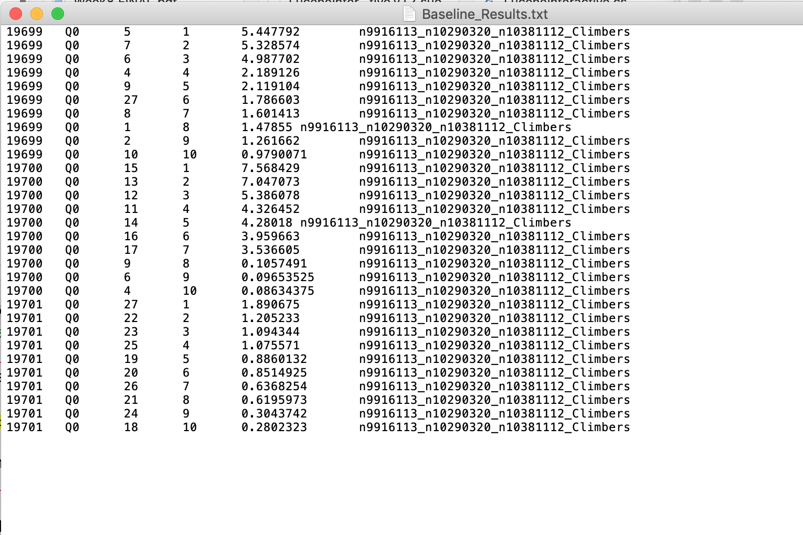

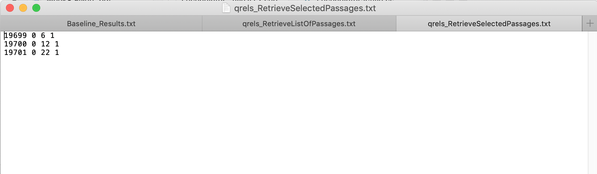

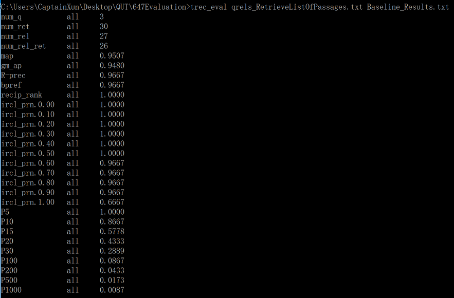

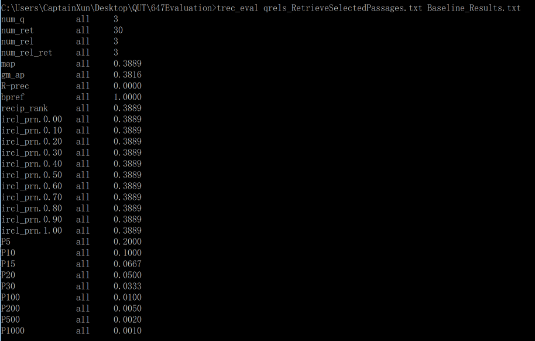

