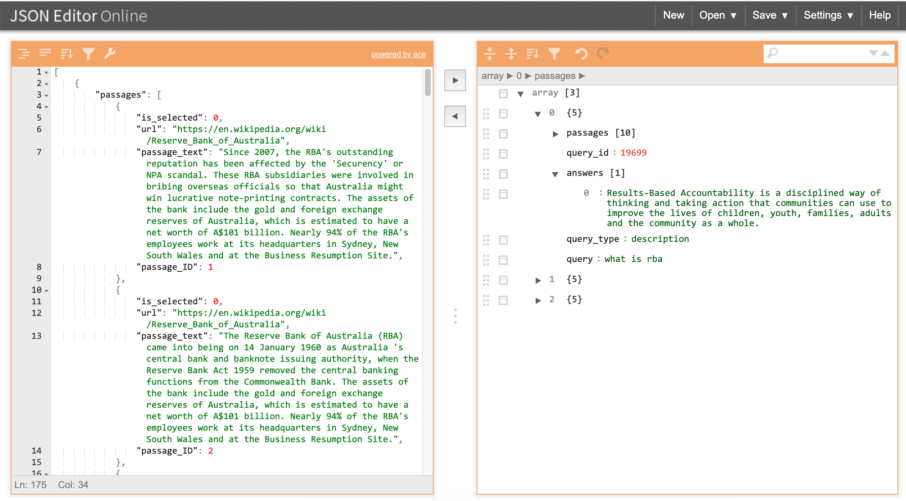

# EduQuiz_Question_Answering_System

#### FYI:

------

### Questions:

1. Document(2 fields)? 1st field-text , 2nd filed-url? // **one field, url+text!**
2. Is it user allowed to choose any indexing strategy?
3. Where should we use the 'query', 'answer'?

------

#### Step1: Create baseline system

- For each passage in the collection, all of the text and url is indexed as a single field. 
- The Analyzer used during index and search is the **Lucene.Net.Analysis.Simple analyzer**. 
- The index does not save information related to field normalisation. 
- The index does not save information related to term vectors. 

1. #### Task 1 — **Index**:

   **mockup: Indexing Strategy** is not settled down, just put it there for now

**implemention: Indexing Strategy**

------

#### Progress1: Successfully indexed, and show result of searching 'RBA'—which is a query test;

It is able to open the JSON file based on user browsing, and specify a indexing folder based on user browsing. Put a hard coded query of 'RBA' to search for the results, the results are just simply displayed at the bottom of the Indexing Page.

------

